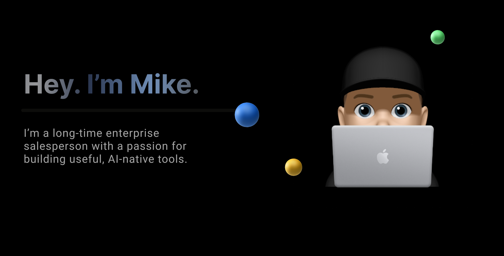

  

 

---

### 📚 Current Focus

- LangGraph & LangChain agent orchestration  
- Structured reasoning + memory in LLM apps  
- Real-time voice analytics (Deepgram + Pinecone)

---

<h3>Let's Connect</h3>

<!--
**harehimself/harehimself** is a ✨ _special_ ✨ repository because its `README.md` (this file) appears on your GitHub profile.

Here are some ideas to get you started:

- 🔭 I’m currently working on ...
- 🌱 I’m currently learning ...
- 👯 I’m looking to collaborate on ...
- 🤔 I’m looking for help with ...
- 💬 Ask me about ...
- 📫 How to reach me: ...
- 😄 Pronouns: ...
- ⚡ Fun fact: ...
-->
